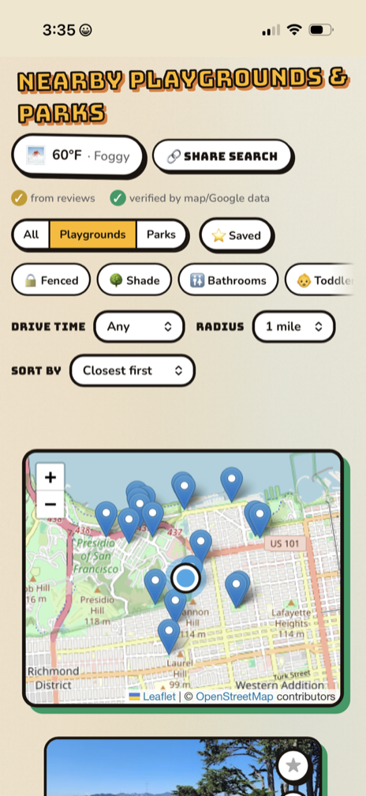
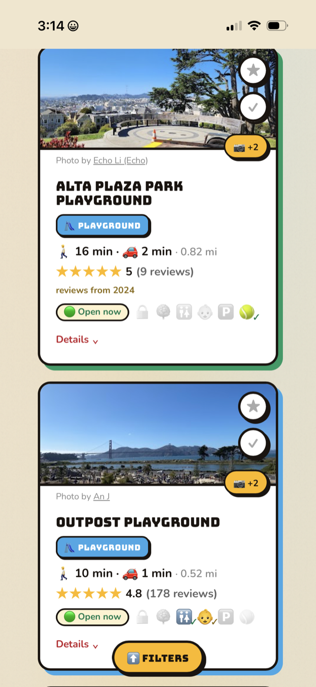
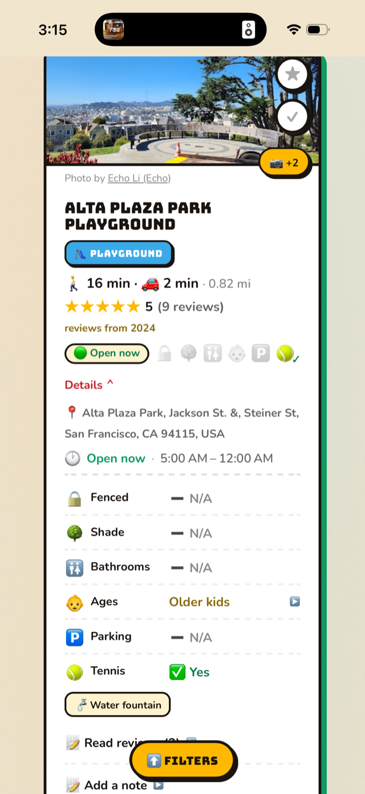

<div align="center">


# Playground &amp; Park Finder

**Find playgrounds and parks with the features that actually matter —
fenced, shaded, bathrooms, parking, toddler-friendly, tennis — read from
real reviews by AI and verified against map data.**

### [▶ Try the live app &nbsp;→&nbsp; playground-finder-1.vercel.app](https://playground-finder-1.vercel.app)

[](https://playground-finder-1.vercel.app)
&nbsp;

&nbsp;


</div>

---

## What it is

Map apps tell you a park *exists*. They don't tell you what a parent of a
little kid needs to know before loading everyone into the car: is it
**fenced** so a toddler can't bolt? Is there **shade** in July? A
**bathroom**? Somewhere to **park**? That information is buried in hundreds
of reviews nobody has time to read.

**Playground & Park Finder reads the reviews for you.** Search any address
(or use your location), and each nearby park shows clear answers for the six
things that matter most — pulled from real reviews and cross-checked against
public map data.

## Screenshots

<div align="center">
  
  &nbsp;
  
  &nbsp;
  
</div>

## How it works

Behind every search:

1. **Find the parks.** The Google Places API returns nearby playgrounds and
   parks with photos, ratings, hours, and recent Google reviews.
2. **Read the reviews with AI.** Each park's reviews go to Google's
   **Gemini 2.5 Flash-Lite** model, which extracts structured yes/no answers
   to seven specific questions (including "do the bathrooms have a changing
   table?") and writes a one-line summary for each.
3. **Cross-verify against the map.** The same parks are looked up in
   OpenStreetMap, whose community has tagged real-world features (fences,
   restrooms, parking, splash pads…). Where the map confirms a feature, it's
   marked **verified**.
4. **Layer in Google's own facts.** Google publishes structured fields for
   some parks (has a restroom, good for children); these are treated as
   first-party truth.

Each feature shows one of two badges — **from reviews** (Gemini's read) or
**verified** (confirmed by map / Google data) — labeled honestly so you
always know the source.

## Features

- 🔒 Fenced · 🌳 Shade · 🚻 Bathrooms (incl. 🧷 changing tables) ·
  👶 Toddler-friendly · 🅿️ Parking · 🎾 Tennis — all filterable
- 💬 **Ask about a park** — type your own question ("baby swings?", "muddy
  after rain?") and Gemini answers from that park's own reviews, citing how
  many it read, and saying so when the reviews don't cover it
- 👶 One-tap **"Toddler-ready" preset** — fenced + bathrooms + toddler-friendly
  in a single tap
- 🕐 "Open now" filter, plus an open/closed pill on every card
- 🌤 Weather that helps you decide: live temps + hourly rain outlook, and when
  it matters the app offers one tap to act on it — "Hot day: show shaded
  parks", "Rain later: show parks open now"
- 🗂 Compact, collapse-by-default park cards — an at-a-glance icon strip up
  front, full details (hours, address, review summaries, amenities) one tap away
- 📸 Swipeable photo carousel — extra photos are fetched only when you tap,
  so the photo API bill scales with curiosity, not with searches
- 🚗 Estimated drive time, for nap-window planning
- 📲 Playdate-ready sharing — sends a message with the park's known features
  and a directions link, not just a bare URL
- ↩ Remembers you — one tap resumes your last search; first-time visitors get
  sample cities to try (San Francisco · New York · London)
- ⭐ Save favorites and private notes (stored on your device) · 👻 hide
  parks you've already visited
- 📱 Installable as an app (PWA), works offline, with pull-to-refresh

## Built with

- **Frontend:** HTML, CSS, and vanilla JavaScript written from scratch — no
  framework. Installable as a Progressive Web App.
- **Backend:** [Vercel](https://vercel.com/) serverless functions (Node) that
  keep API keys server-side.
- **AI:** [Google Gemini 2.5 Flash-Lite](https://ai.google.dev/gemini-api/docs/models).
- **Data:** [Google Places API](https://developers.google.com/maps/documentation/places/web-service/overview),
  [OpenStreetMap](https://www.openstreetmap.org/) (Overpass),
  [Open-Meteo](https://open-meteo.com/) (weather),
  [Nominatim](https://nominatim.org/) (address search).
- **Maps:** [Leaflet](https://leafletjs.com/) with OpenStreetMap tiles.

## Running locally

A static site with serverless API functions, deployed on Vercel:

```bash
npm i -g vercel
vercel dev
```

Requires `GOOGLE_PLACES_API_KEY` and `GEMINI_API_KEY` as environment
variables. The frontend (`index.html` / `app.js` / `style.css`) is plain
static files.

## Security & privacy

- **API keys stay server-side.** Google Places and Gemini are called from serverless functions, so keys are never sent to the browser or committed to the repo.
- **Strict Content-Security-Policy.** Scripts, styles, images, and network calls are restricted to a short, explicit allowlist, which closes off most injection and data-exfiltration paths.
- **Hardened HTTP headers.** HSTS with preload (HTTPS-only), X-Frame-Options DENY (no clickjacking), nosniff, a strict Referrer-Policy, and a Permissions-Policy that disables camera, microphone, and payment and limits geolocation to this site.
- **Verified third-party code.** The Leaflet map library loads with Subresource Integrity, so a tampered CDN file is rejected.
- **Output escaping and input bounds.** Text from external sources (such as park names) is escaped before it is displayed, and user input is length-bounded, to prevent cross-site scripting (XSS).

No accounts, no tracking. Favorites, notes, recent searches, and your home
location live only in your browser — nothing is sent to a server or shared.

## About

A personal project by **Alex** — free to use, no ads. Built to learn by
shipping a real, end-to-end AI product. Feedback welcome via the in-app link.

MIT licensed — see [LICENSE](LICENSE).
